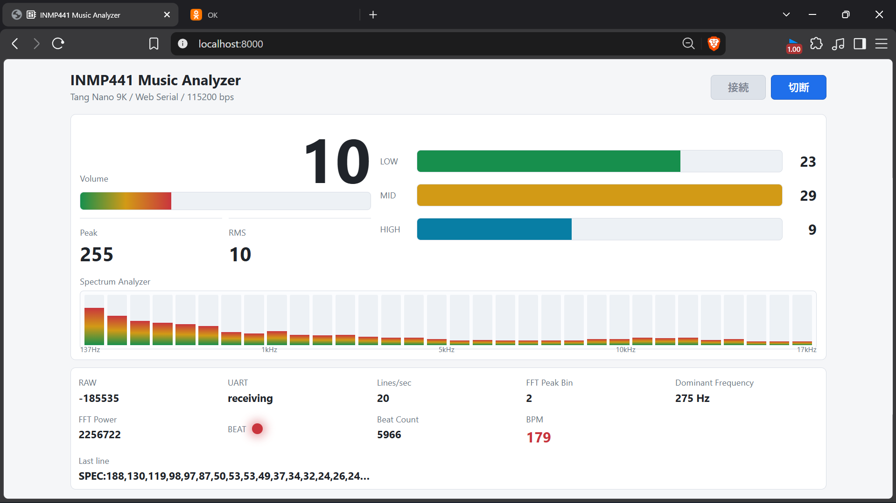

# Tang Nano 9K + INMP441 FPGA Music Analyzer

Tang Nano 9KでINMP441のI2S音声を受信し、音量、3帯域、FFTスペクトラム、Beat、BPMをFPGA内で解析する音楽アナライザーです。解析結果はUART 115200bpsでPCへ送り、ChromeまたはEdgeのWeb Serial UIにリアルタイム表示します。



v1.1では、I2S入力からWeb表示までの一連の動作に加え、低域を細かく表示する非均等32-band Spectrumを実装しています。FPGAへの通常の書き込み方法はSRAM Programです。Flash書き込みは使用しません。

## 主な仕様

| 項目 | 内容 |
| --- | --- |
| FPGAボード | Sipeed Tang Nano 9K（GW1NR-9） |
| マイク | INMP441 I2S MEMS microphone |
| システムクロック | 27MHz |
| サンプリング周波数 | 35,156.25Hz |
| PCM | signed 24bit |
| 音量解析 | Peak、RMS相当値 |
| 帯域解析 | LOW / MID / HIGH |
| FFT | 256-point radix-2 iterative FFT |
| 窓関数 | 256-point Hann window |
| スペクトラム | 正周波数binを32表示bandへ圧縮 |
| Beat検出 | FFT低域powerを使ったadaptive detection |
| BPM検出 | Beat間隔を1ms単位で計測 |
| PC通信 | UART 115200bps、8-N-1 |
| 表示 | Web Serial API |

## システム構成

```text
INMP441
  |
  v
I2S Receiver
  |
  v
signed 24bit PCM
  |---> Peak / RMS / 3-band Analyzer (LOW / MID / HIGH)
  |
  `---> Hann Window
          |
          v
       256-point FFT
          |---> FFT Peak Bin / Dominant Frequency
          |---> 32-band Spectrum
          `---> raw power bin 1-3
                    |
                    v
              Beat Detection
                    |
                    v
               BPM Detection

各解析結果 ---> UART 115200bps ---> Web Serial UI
```

3帯域解析とFFT解析は同じPCM入力から独立して動作します。Beat検出には8bitへ圧縮したSpectrum値ではなく、FFTのraw magnitude squaredを使用します。

## FPGA内の解析

### Peak / RMS / 3帯域

約100ms単位でPeak、RMS相当値、LOW、MID、HIGHを更新します。3帯域は軽量な一次IIRを使って分離しているため、境界は急峻ではありません。

| 帯域 | おおよその範囲 |
| --- | --- |
| LOW | 250Hz以下 |
| MID | 250Hz～1.4kHz付近 |
| HIGH | 1.4kHz以上 |

### 256-point FFT

- 256-point radix-2 DIT iterative FFT
- 1個のbutterfly演算器を時間共有
- fixed-point演算
- signed 24bit PCMの上位18bitを使用
- Hann係数はQ1.15
- 各butterfly出力で1bit右シフトし、全体を1/256 scaling
- sqrtを使わず、`Re^2 + Im^2`でpowerを計算
- DCのbin 0を除外し、bin 1～127を解析
- 周波数分解能は約137.329Hz/bin

32-band Spectrumは、低域を細かく、高域を広くまとめる非均等mappingです。各band内の最大powerを取り、簡易log圧縮によって0～255へ変換します。

| 表示band | FFT bin | 1 bandあたりの幅 |
| --- | --- | --- |
| 0～7 | 1～8 | 1bin |
| 8～15 | 9～24 | 2bin |
| 16～23 | 25～56 | 4bin |
| 24～30 | 57～119 | 9bin |
| 31 | 120～127 | 8bin |

### Adaptive Beat Detection

Beat検出にはFFTの低域raw powerを使用します。

- 対象：bin 1～3（約137Hz、275Hz、412Hz）
- `beat_energy = power(bin1) + power(bin2) + power(bin3)`
- baseline：EMA、`baseline += (energy - baseline) / 32`
- threshold：`baseline × 1.5`
- warmup：32 FFT frames
- onset detection：thresholdを下から上へ超えた立ち上がりを検出
- refractory：26 FFT frames、約195ms
- Beat検出ごとに16bit `beat_count`を加算

### BPM Detection

- 27MHzを27,000分周して1ms tickを生成
- Beat間隔を`interval_ms`として計測
- `BPM = 60000 / interval_ms`
- 有効範囲：40～220 BPM（273～1500ms）
- 範囲外のintervalでは現在のBPMを維持
- 16bit shift/subtract iterative dividerを使用
- 除算は16反復で、DSPを使用しない
- 最初の有効BPMは直接採用
- 2回目以降はEMA `bpm += (new_bpm - bpm) / 4`で平滑化

## UART出力

通常レポートとSpectrumレポートを、それぞれ約10回/秒送信します。Web画面のLines/secは合計で約20になります。

通常レポート：

```text
RAW:-12345 PEAK:6 RMS:4 LOW:12 MID:5 HIGH:2 FFT_BIN:4 FFT_PWR:540645101 BEAT:1 BEAT_COUNT:27 BPM:120 BPM_VALID:1
```

Spectrumレポート：

```text
SPEC:12,18,25,44,93,120,87,64,52,40,35,31,28,25,22,20,18,16,15,14,13,12,11,10,9,8,7,6,5,4,3,2
```

`SPEC`には32個の0～255の値が入り、低域から高域の順に並びます。`BEAT`は前回レポート以降にBeatがあったことを表し、`BPM_VALID=0`の間はBPMが未確定です。

## Web Serial UI

Web UIでは次の情報を確認できます。

- Volume
- Peak / RMS
- LOW / MID / HIGH
- 32-band Spectrum
- FFT Peak Bin
- Dominant Frequency
- FFT Power
- Beat Indicator
- Beat Count
- BPM
- RAW、UART状態、Lines/sec、Last line

SpectrumはUARTから届く約10fpsを維持し、attack/release smoothingを適用します。数値表示は読みやすい周期に抑え、FFT Peak Binには直近5回の中央値を使用します。Beat IndicatorとBeat CountはBeat受信時に即時更新します。

## 接続とピン設定

現在の`constraints/tang_nano_9k.cst`で使用するピンです。ピン番号を推測で変更しないでください。

| 信号 | FPGA pin | 接続先 |
| --- | ---: | --- |
| `clk` | 52 | Tang Nano 9K 27MHz clock |
| `led0` | 10 | Tang Nano 9K LED0、Active Low。通常時は消灯 |
| `uart_tx` | 17 | オンボードUSB-UART bridge |
| `mic_sd` | 25 | INMP441 SD |
| `mic_ws` | 26 | INMP441 WS |
| `mic_sck` | 27 | INMP441 SCK |
| `mic_lr` | 28 | INMP441 L/R。FPGAからLowを出力 |

INMP441のVDDは3.3V、GNDはGNDへ接続します。`mic_lr`がLowのため、左チャンネルを受信します。

## ディレクトリ構成

| パス | 内容 |
| --- | --- |
| `src/` | Verilog-2001 RTL |
| `tb/` | Icarus Verilog用テストベンチ |
| `constraints/` | Tang Nano 9Kのピン制約と27MHzタイミング制約 |
| `scripts/` | simulation、GOWIN build、SRAM Program用スクリプト |
| `web/` | Web Serial UI |
| `build/` | simulationおよびGOWIN EDA生成物。Git管理対象外 |

## 必要なツール

- GOWIN EDA
- GOWIN Programmer
- Icarus Verilog（`iverilog`、`vvp`）
- Python 3（Web UIのローカル配信用）
- Web Serial対応のChromeまたはEdge

GOWINツールがPATHにない場合は、`GOWIN_HOME`をインストールディレクトリへ設定します。各PowerShellスクリプトは、`GOWIN_HOME`以下の標準パスまたはPATHから実行ファイルを探します。

## Simulation

リポジトリルートで実行します。Icarus Verilogが`C:\iverilog\bin`にある場合の例です。

```powershell
$env:Path += ";C:\iverilog\bin"
powershell -ExecutionPolicy Bypass -File scripts\run_sim.ps1
```

現在は次の13テストがすべてPASSします。

1. `sync_fifo_tb`
2. `dot_product_accel_tb`
3. `uart_heartbeat_tb`
4. `audio_uart_path_tb`
5. `top_audio_uart_tb`
6. `audio_band_analyzer_tb`
7. `audio_fft_analyzer_tb`
8. `fft_spectrum_bands_tb`
9. `spectrum_uart_path_tb`
10. `beat_detector_tb`
11. `audio_beat_integration_tb`
12. `bpm_divider_tb`
13. `bpm_detector_tb`

## GOWIN build

リポジトリルートで次を実行します。このスクリプトはbuildのみを行い、FPGAへの書き込みは行いません。

```powershell
powershell -ExecutionPolicy Bypass -File scripts\build.ps1
```

生成されるSRAM用bitstream：

```text
build/button_uart_count/impl/pnr/button_uart_count.fs
```

### v1.1最終結果

| 項目 | 結果 |
| --- | ---: |
| LUT | 1871 |
| FF | 2242 |
| DSP | 3.5 / 10 |
| BSRAM | 3 / 26 |
| Fmax | 39.541MHz |
| Target | 27.000MHz |
| Setup slack | +11.747ns |
| Hold slack | +0.589ns |

27MHzのタイミング制約を満たし、setup/hold違反はありません。

## SRAM Program

Tang Nano 9KをUSBで接続し、必要に応じてデバイスを確認してからSRAMへ書き込みます。

```powershell
powershell -ExecutionPolicy Bypass -File scripts\scan.ps1
powershell -ExecutionPolicy Bypass -File scripts\program_sram.ps1
```

`program_sram.ps1`は、既定で次の最新bitstreamを使用します。

```text
build/button_uart_count/impl/pnr/button_uart_count.fs
```

別の`.fs`を指定する場合：

```powershell
powershell -ExecutionPolicy Bypass -File scripts\program_sram.ps1 -FsFile path\to\image.fs
```

SRAM Programの内容は電源を切ると消えます。このプロジェクトではFlash書き込みを通常手順として扱わず、実機確認にはSRAM Programのみを使用します。

## Web UIの起動

SRAM Program後、Web UIをlocalhostで配信します。

```powershell
Set-Location web
py -m http.server 8000
```

ChromeまたはEdgeで次を開きます。

```text
http://localhost:8000
```

「接続」ボタンを押し、Tang Nano 9KのUSB-UART COMポートを選択します。UART設定は115200bps、8bit、Parity None、Stop bit 1です。他のシリアルターミナルが同じCOMポートを開いている場合は、先に切断してください。

## 注意事項

- 実機への通常の書き込みはSRAM Programを使用してください。
- Flash書き込みは実行しないでください。
- `build/`、GOWIN生成ログ、波形、一時ファイルはGit管理対象外です。
- ピン制約を変更する前に、ボードと配線を確認してください。
- LED0はActive Lowで、通常動作中は常時消灯です。
